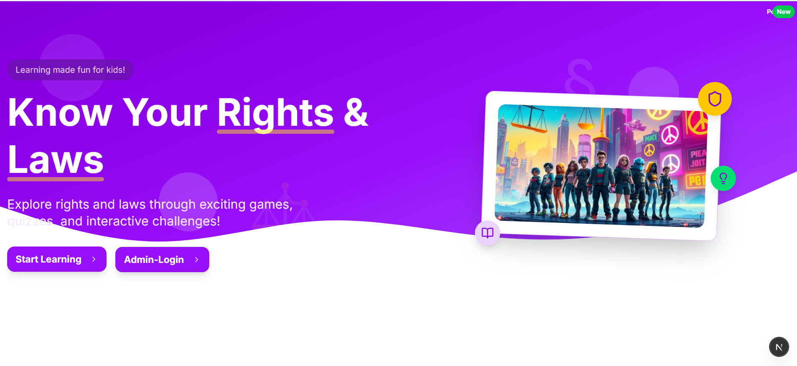
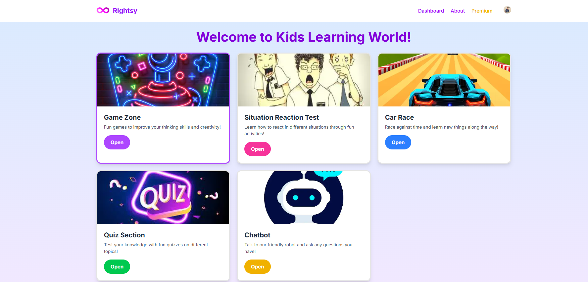
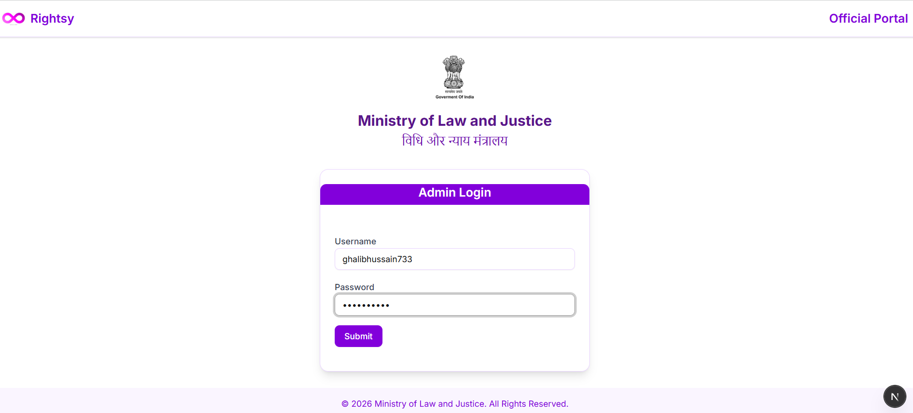
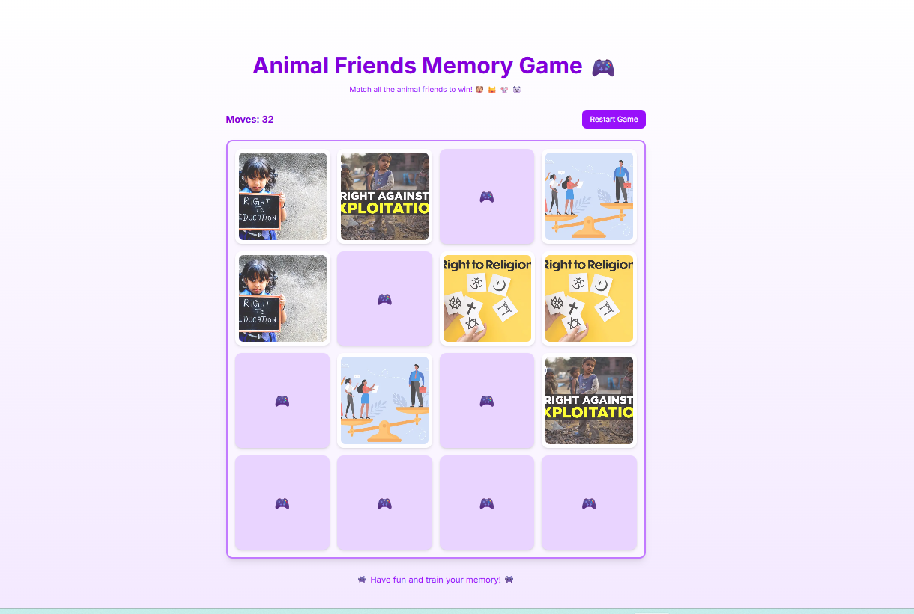
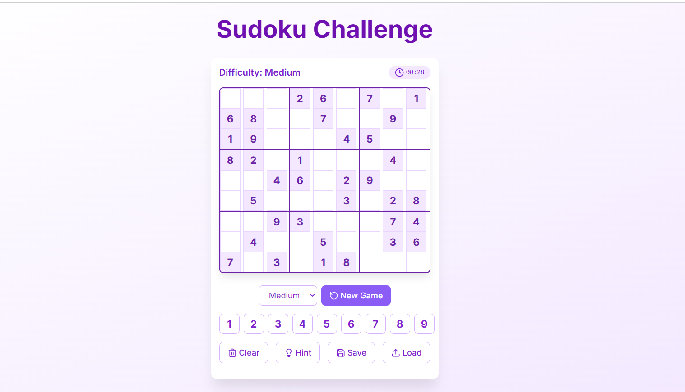
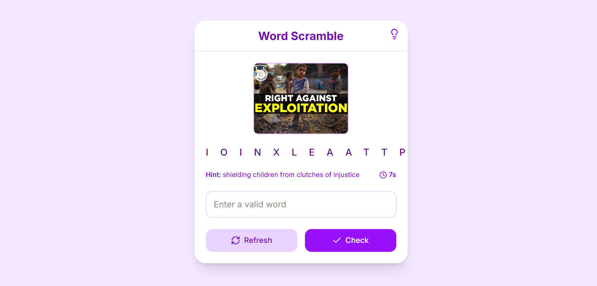
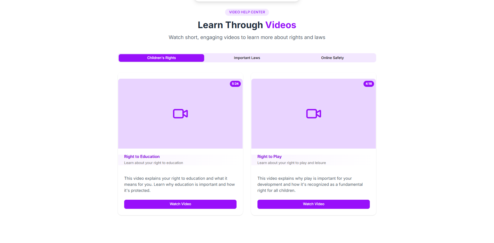
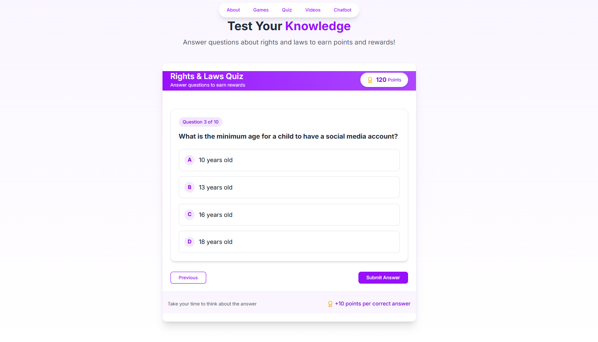
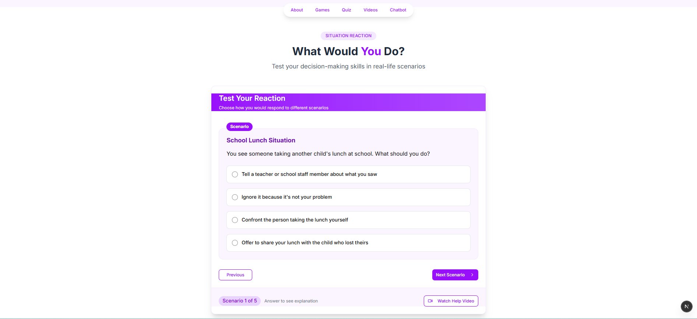
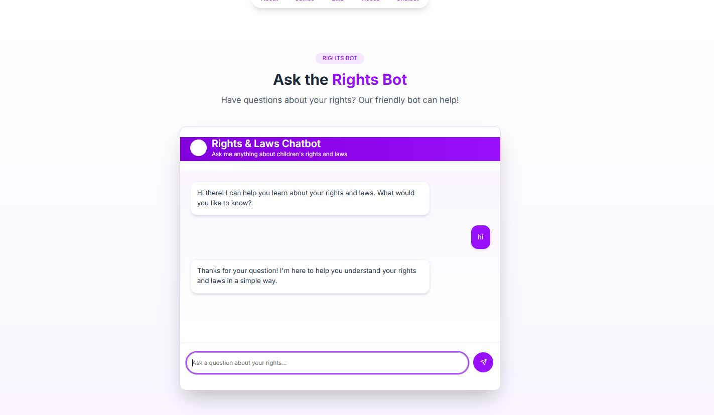

# 🎮 Rightsy – Gamified Legal Education Platform for Kids (6–16)

**Rightsy** is a gamified legal education platform designed to teach **Indian laws, rights, and civic responsibilities** to children aged **6–16** in a fun, interactive, and engaging way.  
The platform combines **games, quizzes, animated videos, real-life scenarios, and an AI chatbot** to make legal awareness simple and enjoyable.

---

## 🌟 Key Highlights

- 🎯 Target age group: **6–16 years**
- 🎮 **3+ interactive educational games**
- 🎬 Short animated videos explaining laws & rights
- 🧠 Quiz-based learning
- ⚡ Situation Reaction Test (real-life scenarios)
- 🤖 AI-powered chatbot assistance
- The Admin Panel allows administrators to **monitor and manage user activity** across the platform
- 🇮🇳 Content aligned with **Indian laws and fundamental rights**

---

## 🏠 Home Dashboard

The home screen acts as a central hub where users can explore all features such as games, quizzes, chatbot, and learning modules.

---
## 🛡️ Admin Panel

The Admin Panel allows administrators to **monitor and manage user activity** across the platform.

- Track games played, quiz attempts, scores, and time spent
- Monitor Situation Reaction Test responses and chatbot usage
- View user engagement and learning progress
- Identify active and inactive users
- Improve content based on user behavior and learning patterns

The panel is secured with **role-based access** to ensure safe and controlled data management.

## 🎮 Interactive Learning Games

Rightsy uses **play-based learning** to teach legal concepts.  
Whenever a user gets stuck in a game, a **short animated video** related to **Indian laws or rights** is displayed to guide them.

### 🧩 Memory Test Game
Improves memory while reinforcing legal concepts and rights.

---

### 🔢 Sudoku (Law Edition)
A logic-based Sudoku game integrated with legal awareness concepts.

---

### 🔤 Word Scramble
Helps users learn legal terms and rights-related vocabulary in a fun way.

---

### 🧠 Puzzle Game
Interactive puzzles connected with laws, duties, and civic values.

---

## 🎬 Animated Law & Rights Videos

If a user faces difficulty during gameplay, **short animated videos** appear to explain:
- Fundamental Rights
- Child Rights
- Basic Indian Laws
- Civic Duties

---

## 📝 Quiz Section – Law & Rights Quiz

This section tests the user’s understanding of:
- Fundamental Rights
- Child Protection Laws
- Basic Legal Awareness

Users receive instant feedback to help them learn effectively.

---

## ⚡ Situation Reaction Test

The Situation Reaction Test presents **real-life legal scenarios** to evaluate how users respond.  
This helps children:
- Develop critical thinking
- Understand correct legal actions
- Become socially responsible citizens

---

## 🤖 AI Chatbot Assistance

An AI-powered chatbot that:
- Answers questions related to laws and rights
- Helps users when they are confused
- Explains concepts in **simple and child-friendly language**

---

## 🛠️ Tech Stack

- **Frontend:** React / Next.js  
- **Backend:** Node.js / API-based architecture  
- **AI:** NLP-powered chatbot  
- **UI/UX:** Gamified and kid-friendly design  
- **Media:** Animated explainer videos  

---

## 🎯 Project Objective

The main objective of **Rightsy** is to:
- Introduce legal education at an early age
- Spread awareness about **Indian rights and duties**
- Build informed, responsible, and confident future citizens

---

## 🚀 Future Enhancements

- 🎖️ Gamification with rewards and badges
- 📊 User progress tracking
- 🌍 Multi-language support
- 👨‍👩‍👧 Parent and teacher monitoring dashboard

---

## 📸 Screenshots

All application screenshots are available in the `images/` folder of this repository.

---

## 🤝 Contributing

Contributions are welcome!  
Fork the repository, create a new branch, and submit a pull request.

---

## 📬 Contact

**Ghalib Hussain**  
GitHub: [https://github.com/Ghalib18](https://github.com/Ghalib18)

---

⭐ If you like this project, don’t forget to give it a star!
